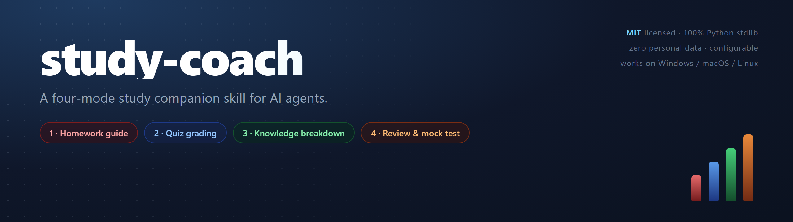
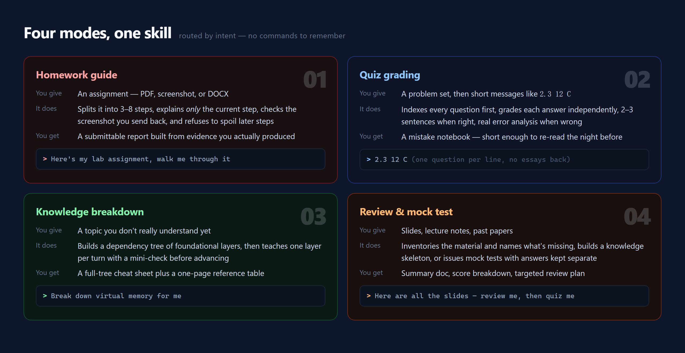
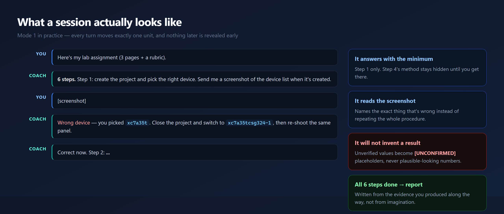
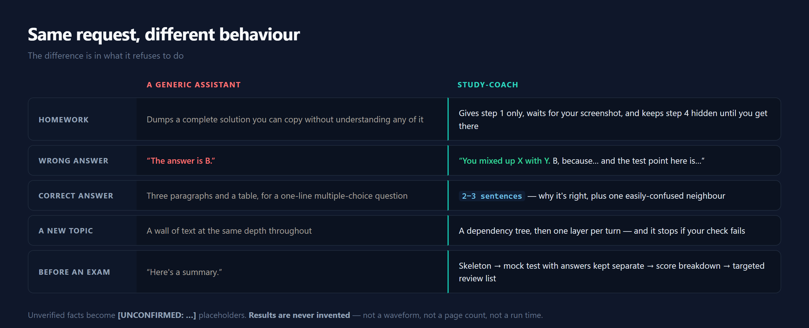
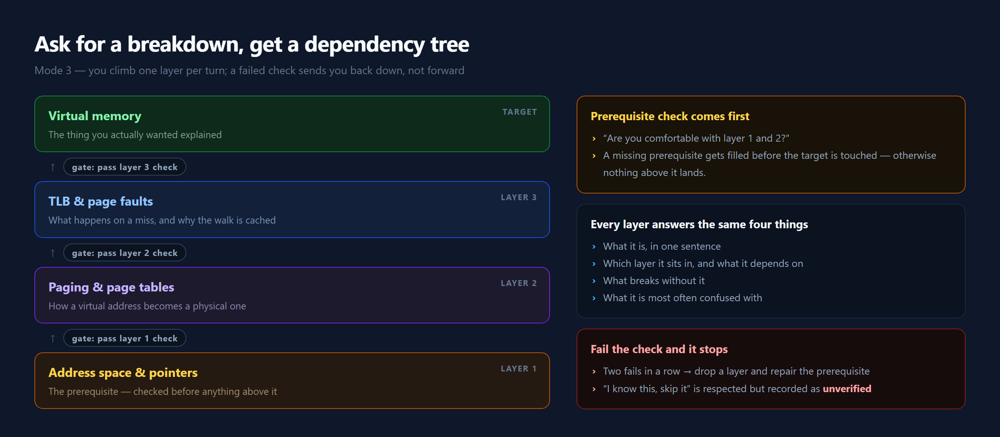
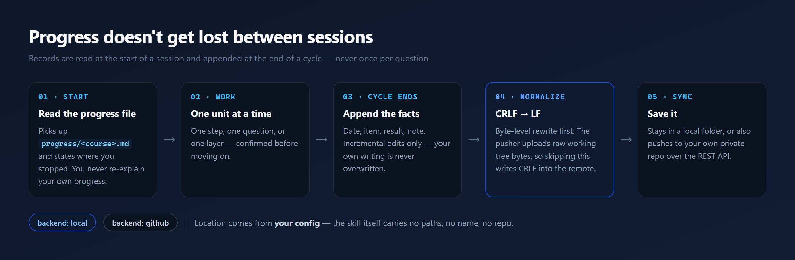
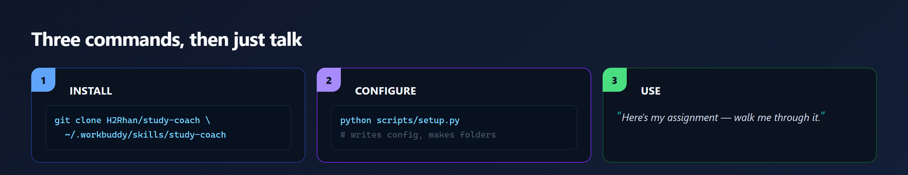

A **four-mode study companion skill** for AI coding agents (Claude Code / WorkBuddy and anything else that
reads the `SKILL.md` convention). It turns an agent from "answer machine" into a coach: it walks you through
homework step by step, grades your answers item by item, decomposes a topic into foundations, and drills you
before an exam.

Ships with **no personal data** — paths, records location, and optional identity fields all come from a local
config file that `scripts/setup.py` generates.


## Contents

- [Why this exists](#why-this-exists)
- [The four modes](#the-four-modes)
- [What a session actually looks like](#what-a-session-actually-looks-like)
- [Same request, different behaviour](#same-request-different-behaviour)
- [A closer look at mode 3](#a-closer-look-at-mode-3)
- [Records that survive between sessions](#records-that-survive-between-sessions)
- [Install](#install)
- [Configure (one time)](#configure-one-time)
- [Then just talk to your agent](#then-just-talk-to-your-agent)
- [Design principles](#design-principles)
- [FAQ](#faq)
- [What's in here](#whats-in-here)
- [Platform support](#platform-support)
- [Publishing updates](#publishing-updates)
- [Contributing](#contributing)
- [License](#license)

## Why this exists

Ask a general assistant to help with homework and you get a complete solution you can copy without
understanding it. Ask it to check an answer and you get either a bare "the answer is B" or three paragraphs
about a one-line multiple-choice question. Neither is what a student actually needs at 11pm before a deadline.

study-coach encodes a different set of defaults, as hard rules rather than good intentions:

- **One unit at a time.** It never reveals the method for a step you haven't reached.
- **It reads your evidence.** A screenshot is inspected, not assumed. The reply names the exact thing that's wrong.
- **It never invents.** Unverified numbers, run outputs, and exam-frequency claims become `[UNCONFIRMED: …]` placeholders.
- **It remembers.** Progress lives in a file, so a new session resumes without you re-explaining anything.

## The four modes



| Mode | You give it | What it does | You end up with |
|---|---|---|---|
| **1 · Homework guide** | An assignment (PDF / image / DOCX) | Splits it into 3–8 steps, explains only the current step, checks the screenshot you send back, and refuses to spoil later steps | A submittable report (DOCX/PDF), built from the evidence you actually produced |
| **2 · Quiz grading** | A problem set + short messages like `2.3 12 C` | Indexes every question first, grades each answer independently, adds a 2–3 sentence note when you're right and a real error analysis when you're wrong | A mistake notebook, not a wall of text |
| **3 · Knowledge breakdown** | "Explain X" | Builds a dependency tree of the foundational layers, then teaches one layer per turn with a mini-check before advancing | A full-tree cheat sheet + one-page reference table |
| **4 · Review & mock test** | Slides, lecture notes, past papers | Inventories the material (and tells you what's missing), builds a knowledge skeleton, or issues mock tests with the answers kept separate | Summary doc, score breakdown, targeted review plan |

Cross-cutting behaviour: it reads its source material before speaking, never fabricates results, always advances
one step at a time, and syncs progress to a folder or private GitHub repo so a later session can pick up where
you left off.

## What a session actually looks like



The rhythm is the whole point. You send the assignment; you get **step 1 only**. You send a screenshot; it
either names the exact defect and asks for a re-shot, or confirms in one line and releases the next step — and
only then is step 2's method revealed. All the steps done, the report is written from what you actually
produced, not from imagination.

## Same request, different behaviour



## A closer look at mode 3



Mode 3 is not a summary. It is a **dependency tree plus a gate at every level**: the prerequisite is checked
before anything above it is touched, each layer answers the same four questions, and a failed check sends you
back down rather than forward. Two failures in a row drop another layer and repair the prerequisite.

## Records that survive between sessions



`progress/`, `mistake-books/`, and `summaries/` live under `records.local_root`. A session reads the matching
progress file before saying anything, and appends to it when a cycle ends — never once per question, which would
produce dozens of trivial commits. Set `records.backend` to `github` to also push to your own private repo;
`local` (the default) keeps everything on disk.

## Install



The repository root **is** the skill folder, so cloning is enough:

```bash
git clone https://github.com/H2Rhan/study-coach.git ~/.workbuddy/skills/study-coach
```

Or unzip a release archive into your skills directory:

```bash
unzip study-coach.zip -d ~/.workbuddy/skills/
```

Or copy a project-scoped install:

```bash
cp -r study-coach <your-project>/.workbuddy/skills/
```

## Configure (one time)

```bash
python ~/.workbuddy/skills/study-coach/scripts/setup.py
```

It writes the config, creates the records folders, prepares the deliverables directory, and optionally creates
the private GitHub repo used for syncing. Non-interactive flags and the full key reference are in
[`references/setup.md`](references/setup.md).

```bash
# minimal, no GitHub
python .../scripts/setup.py --non-interactive \
  --deliverables-dir "$HOME/study/submissions" \
  --records-root "$HOME/study-records"

# with GitHub sync
python .../scripts/setup.py --non-interactive \
  --records-backend github --records-repo "youruser/study-records"
```

Check the effective configuration at any time:

```bash
python .../scripts/setup.py --show
```

## Then just talk to your agent

> "Here's my lab assignment, walk me through it."
>
> "2.3 12 C"
>
> "Break down virtual memory for me."
>
> "Here are all the lecture slides — help me review, then quiz me."

The skill routes on intent. If it can't tell which mode you mean, it asks once, with four options.

## Design principles

These are enforced in `SKILL.md` as rules every mode obeys, not as suggestions:

| Principle | What it means in practice |
|---|---|
| Read before speaking | Source material is parsed (OCR for scans) before any claim about its contents |
| One step at a time | Later steps' methods stay hidden unless you explicitly ask for everything |
| Grade independently | A contested answer is verified, not rubber-stamped — user right or wrong is never assumed |
| Never fabricate | `[UNCONFIRMED: …]` instead of a plausible-looking number, waveform, or page count |
| No unprompted files | Nothing is written to disk until you ask for a deliverable or a cycle completes |
| Finished files only | Deliverables are `.docx`/`.pdf`, never a bare `.md` |
| No filler | No platform introductions, no methodology essays, no restating the task in a summary table |

## FAQ

**Won't it just do my homework for me?**
By default it guides, and it will refuse to spoil later steps. If you genuinely want the complete solution,
say so explicitly — that overrides the guard, one step at a time.

**Do I need a GitHub account?**
No. The default `records.backend` is `local`; records stay in a folder. GitHub sync is opt-in and pushes to a
repo you own.

**Where does my data go?**
Nowhere by default. Files are read locally, records are written locally. The only outbound calls are a web
search when a question's answer is contested, and the REST API when you enable the `github` backend.

**Can I use it in Chinese?**
Yes. `output_language: "auto"` follows whatever language you write in. The skill's own documentation is in
English; that doesn't constrain your replies.

**Does it only work in WorkBuddy?**
It's plain `SKILL.md` plus markdown references and stdlib-only Python. Anything that loads skills by that
convention can use it.

**What if the optional companion skills aren't installed?**
It degrades rather than failing: `python-docx` instead of the polished Word route, and if no PDF path exists it
delivers the `.docx` and says so. See
[`references/setup.md`](references/setup.md#6-optional-companion-skills).

## What's in here

```
SKILL.md                        routing, global rules, deliverable pipeline
CHANGELOG.md                    version history
.github/workflows/checks.yml    CI: compiles the scripts, runs setup + sync on Linux, blocks personal paths
references/
  setup.md                      install + configuration reference
  mode1-homework.md             screenshot-guided homework workflow
  mode2-quiz.md                 grading loop + mistake notebook
  mode3-knowledge.md            dependency-tree teaching
  mode4-review.md               summary / mock test / review companion
  record-sync.md                records layout, line-ending handling, sync
scripts/
  setup.py                      first-run configuration
  study_config.py               config loader (stdlib only)
  sync_records.py               discover + normalize + sync records
  github_push.py                self-contained GitHub REST pusher (stdlib only)
  publish_skill.py              maintainer tool: push this folder to its own repo
assets/
  config.example.json           documented config example
  records-repo-README.md        README seeded into your records folder
  templates/                    progress / mistake book / summary, in Chinese and English
  images/                       README artwork; HTML sources under images/_src/
```

All scripts use the Python standard library only — no `pip install` required.

## Platform support

| Capability | Windows | macOS / Linux |
|---|---|---|
| Records / config / sync | yes | yes |
| `.docx` output | yes | yes |
| `.pdf` export | Microsoft Word (COM) | LibreOffice (`soffice --headless`) |

If no PDF route exists, the skill delivers the `.docx` and says so rather than failing silently.

## Publishing updates

The repository root is the skill root, so publishing is one command from inside the skill folder:

```bash
python scripts/publish_skill.py --repo OWNER/NAME --message "fix: correct grading rule" --dry-run
```

It normalizes line endings, skips `config.json` and `__pycache__`, and uploads text and image files
explicitly. Add a release tag in the GitHub UI afterwards if you want a frozen archive for distribution.

## Contributing

Issues and PRs are welcome. The one hard rule: **never commit a real path, name, student ID, or repo name**
into `SKILL.md`, `references/`, `scripts/`, or `assets/`. Everything machine-specific belongs in the config
file, which is generated locally and never shipped. See the note at the end of `SKILL.md`.

## License

MIT — see [LICENSE](LICENSE).
